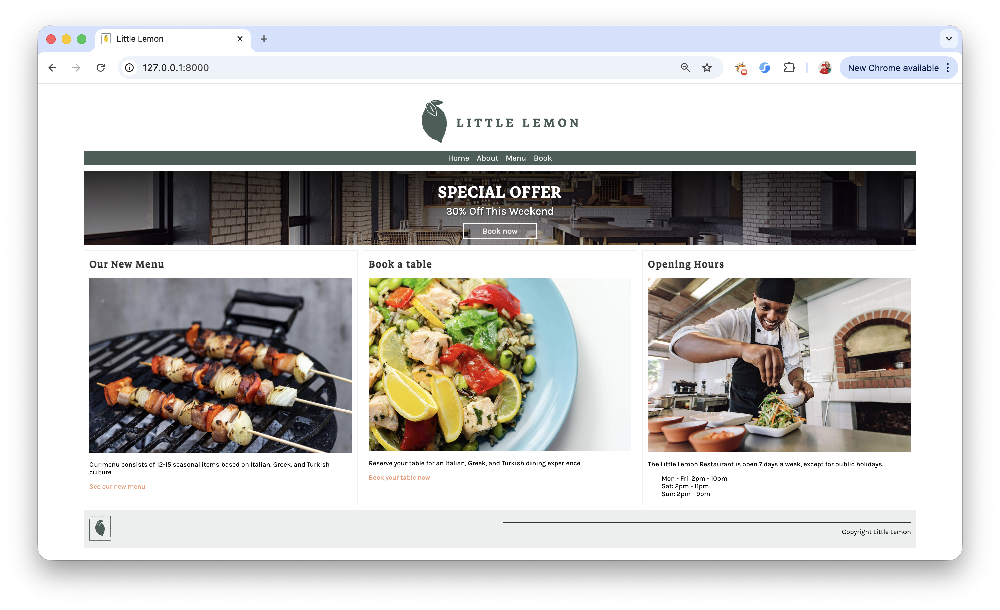
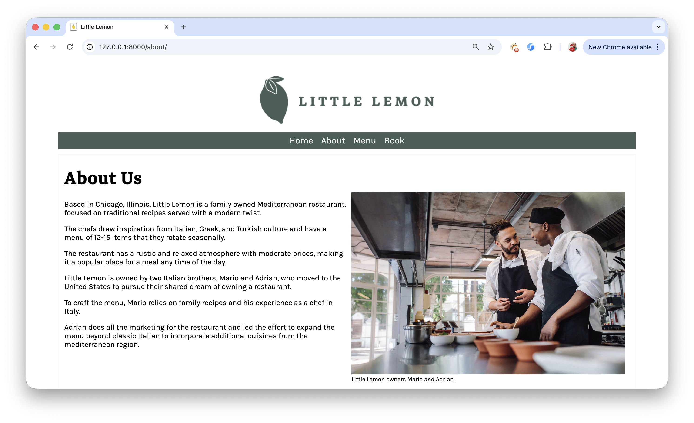
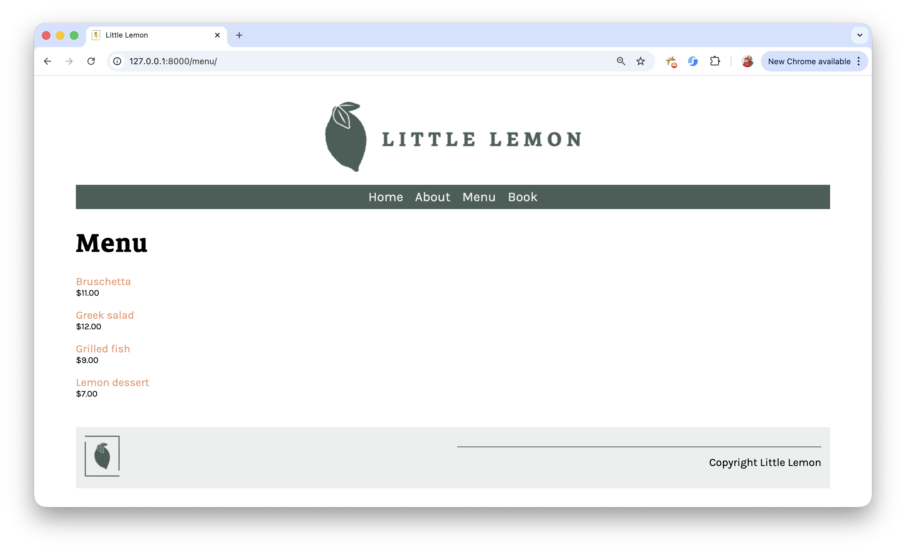
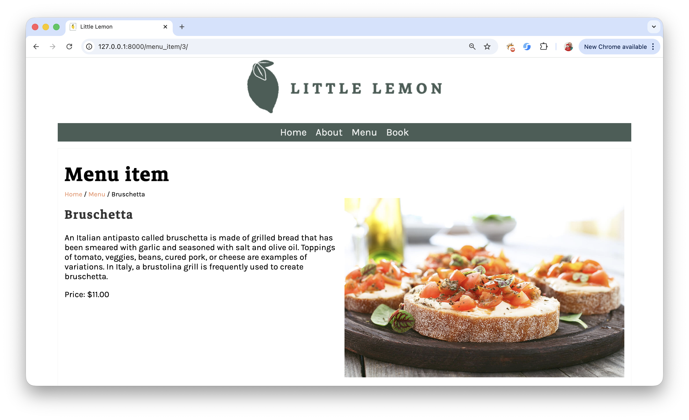
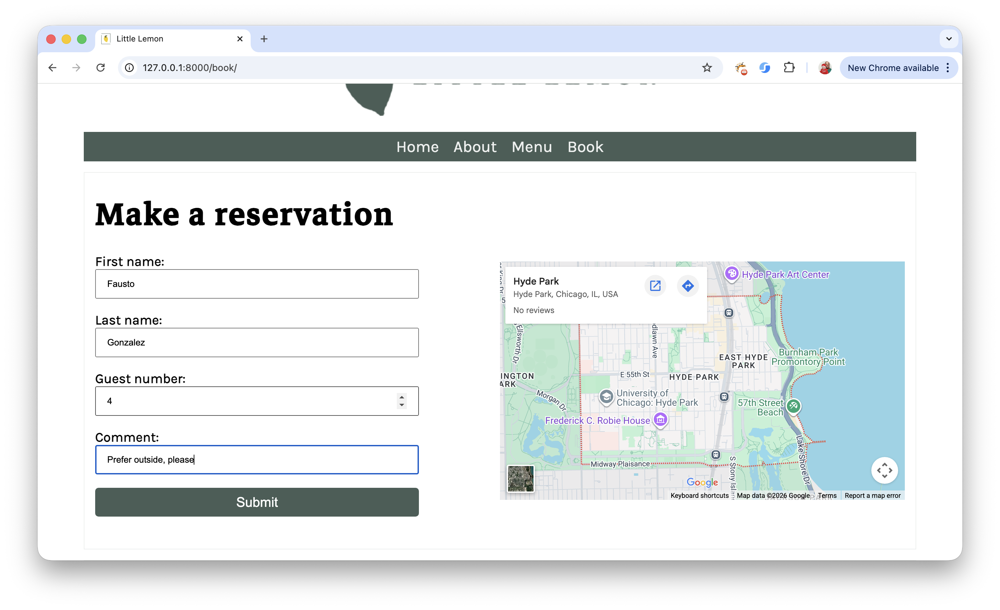
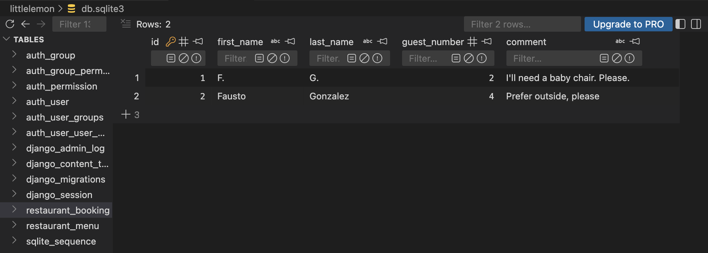
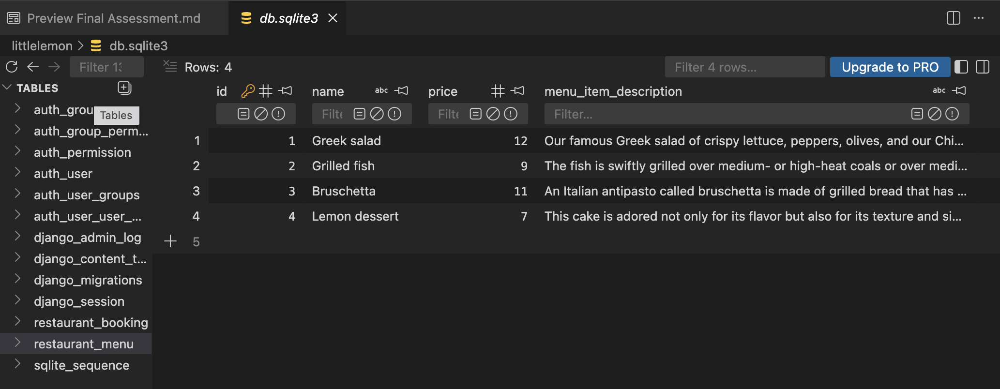

# 🍋 Little Lemon Restaurant Django Website

## 📌 Repository Name  
**littlelemon-restaurant-django-website**

## 📖 Description  
A Django web application implementing the core pages of the fictional Little Lemon restaurant website: Home, About, Booking, Menu, and Menu Item. Demonstrates model creation, migrations, admin customization, dynamic templates, URL parameter handling for detailed menu item views, database‑driven content, and a clean, well‑structured template architecture.

### Short Description  
A Django project for the fictional Little Lemon restaurant featuring dynamic menu pages, database‑driven content, and a clean template structure.

---

# 🚀 Project Overview

This project is a full-stack Django restaurant website built as part of a backend development assessment. It demonstrates:

- Django Models & Migrations  
- Dynamic Views and URL Routing  
- Template Inheritance and Django Template Language (DTL)  
- Django Admin Panel customization  
- Database-driven content using SQLite  
- Static files and image handling  
- Form processing and data persistence  
- URL parameters for dynamic menu item pages  

The website represents **Little Lemon**, a fictional Mediterranean restaurant owned by Mario and Adrian.

---

# 🏗️ Website Layout Structure

## 🔝 Header  
- Centered **Little Lemon logo + restaurant name**  
- Horizontal navigation bar with links:  
  **Home | About | Menu | Book**  
- All links displayed side-by-side in a clean, modern layout  

## 🔻 Footer  
- Left: Little Lemon logo (without the name)  
- Right: `Copyright Little Lemon`

---

# 🌐 Web Pages

---

## 🏠 1. Home Page

The Home page uses a **2-row by 3-column layout**.

### 🔹 First Row (full width)
- **SPECIAL OFFER**  
- *30% Off This Weekend*  
- Fully functional **Book Now** button (fixed from the original template)

### 🔹 Second Row (3 columns)

#### Column 1 — Our New Menu
- Representative image  
- Description of seasonal Mediterranean dishes  
- Link: *See our new menu*

#### Column 2 — Book a Table
- Representative image  
- Invitation to reserve a table  
- Link: *Book your table now*

#### Column 3 — Opening Hours
- Representative image  
- Weekly schedule:  
  - Mon–Fri: 2pm–10pm  
  - Sat: 2pm–11pm  
  - Sun: 2pm–9pm  

### 📸 Home Page Screenshot  


---

## 👨‍🍳 2. About Page

The About page introduces the restaurant:

- Family-owned Mediterranean restaurant in Chicago  
- Inspired by Italian, Greek, and Turkish cuisine  
- Seasonal rotating menu (12–15 items)  
- Rustic, relaxed atmosphere  
- Owned by brothers **Mario and Adrian**  
- Mario: chef using family recipes  
- Adrian: marketing and menu expansion  

Right side:
- Photo of the owners  
- Caption: *Little Lemon owners Mario and Adrian*

### 📸 About Page Screenshot  


---

## 🍽️ 3. Menu Page

Displays all menu items dynamically from the database.

Each item includes:
- **Clickable item name** (links to detail page)  
- **Price** formatted as `$XX.00`  

Example:
`Bruschetta
$11.00`


### 📸 Menu Page Screenshot  


---

## 🍲 Menu Item Detail Page

When clicking a menu item (e.g., *Bruschetta*), the page shows:

- Breadcrumb navigation:  
  `Home / Menu / Bruschetta`
- Item name  
- Full description  
- Price formatted as: **Price: $11.00**  
- Dish image loaded dynamically from `/static/img/menu_items/`

This page uses:
- URL parameter `pk`
- `Menu.objects.get(pk=pk)`
- Dynamic template rendering

### 📸 Menu Item Screenshot  


---

## 📅 4. Book (Reservation) Page

Displays a reservation form with fields:

- First Name  
- Last Name  
- Guest Number  
- Comment  
- Submit button  

Right side:
- **Interactive Google Map** showing the restaurant location  
  - Zoomable  
  - Movable  

### 📸 Booking Page Screenshot  


---

# 🗄️ Database Integration

The project uses **SQLite** as its database.

---

## 📌 Booking Table (`restaurant_booking`)

Stores reservation form submissions:

- `id`  
- `first_name`  
- `last_name`  
- `guest_number`  
- `comment`  

### 📸 Booking Table Screenshot  


---

## 📌 Menu Table (`restaurant_menu`)

Stores menu items:

- `id`  
- `name`  
- `price`  
- `menu_item_description`  

### 📸 Menu Table Screenshot  


---

# 🛠️ Technologies Used

- Python  
- Django  
- SQLite  
- HTML5  
- CSS3  
- Django Template Language (DTL)  
- Django Admin Panel  
- Google Maps Embed  

---

# ▶️ How to Run the Project

```bash
# Clone the repository
git clone https://github.com/yourusername/littlelemon-restaurant-django-website.git

# Navigate into project directory
cd littlelemon-restaurant-django-website

# Install dependencies
pip install -r requirements.txt

# Run migrations
python manage.py migrate

# Create superuser (optional)
python manage.py createsuperuser

# Start development server
python manage.py runserver

# Open in browser:
`http://127.0.0.1:8000/`
